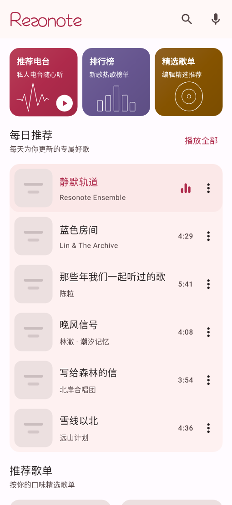
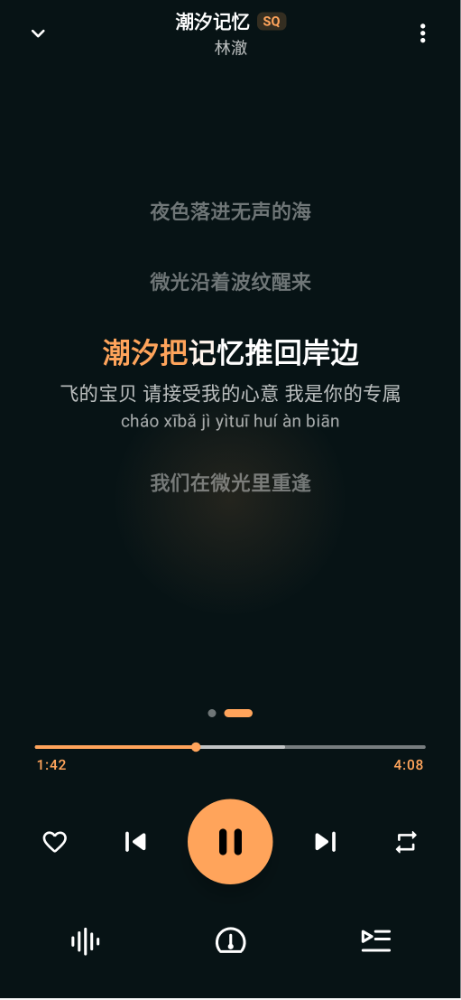
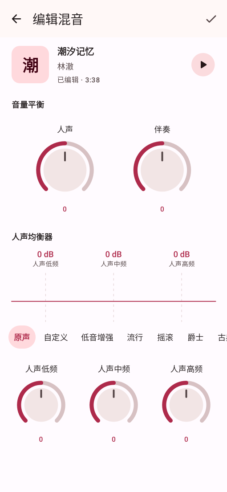

<p align="center">
  
</p>

<p align="center">
  一款专注于发现与聆听的无广告 Android 音乐应用
</p>

Resonote 把在线音乐、本地音乐与个人云盘放进同一套播放体验。打开应用即可浏览和播放，不需要先完成登录或权限配置；当你离开应用后，播放仍可通过系统媒体通知、锁屏和耳机继续控制。

<p align="center">
  
  
  
</p>

## 为聆听而设计

- **发现音乐**：从每日推荐、排行榜、精选歌单、专辑、歌手和聚合搜索找到想听的内容。
- **沉浸播放**：统一的播放队列连接在线、本地和云盘歌曲，并提供同步歌词、逐字高亮、倍速、音质信息与均衡器。
- **系统级连续体验**：支持后台播放、媒体通知、锁屏控制、耳机控制和可配置的音频焦点策略。
- **管理自己的音乐**：通过 Android 文件选择器导入本地音频；登录后访问个人歌单、收藏、历史和音乐云盘。
- **不止于播放**：支持听歌识曲、MV 播放、桌面歌词，以及带录制、试听、混音和导出的 K 歌作品流程。
- **适合你的界面**：支持浅色、深色、AMOLED 和 Android 12+ 动态取色，界面状态覆盖加载、空内容、离线和错误恢复。

## 产品边界

Resonote 没有广告位、开屏广告或与听歌无关的商业打断。在线能力会受到第三方服务可用性、账号状态、地区和内容授权影响，因此不构成长期服务保证。项目仍在持续开发，功能和数据迁移可能随版本演进。

当前支持 Android 8.0（API 26）及以上版本。

## 从源码运行

构建环境需要 JDK 21 和 Android SDK。克隆仓库后运行：

```bash
./gradlew :app:assembleDebug
```

生成的调试安装包位于 `app/build/outputs/apk/debug/`。完整的本地环境、测试和发布说明见[开发指南](docs/DEVELOPMENT.md)。

## 项目文档

- [文档导航](docs/README.md)：长期维护文档及各自职责
- [产品需求](design/PRODUCT_REQUIREMENTS.md)：现行产品范围与行为合同
- [架构说明](docs/ARCHITECTURE.md)：模块边界、数据流与依赖方向
- [设计基础](design/FOUNDATION.md)与[组件系统](design/COMPONENT_SYSTEM.md)：视觉语义和 UI 合同
- [网络能力](docs/api/README.md)：应用当前使用的网络能力与协议边界

## License

Resonote 使用 [MIT License](LICENSE) 开源。
