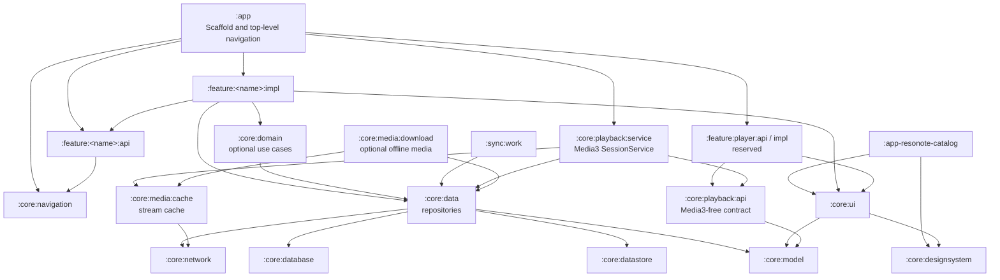
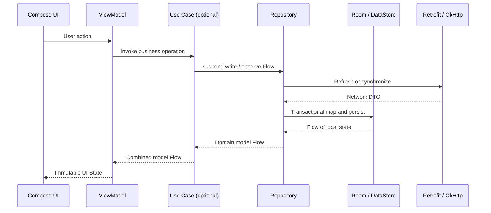
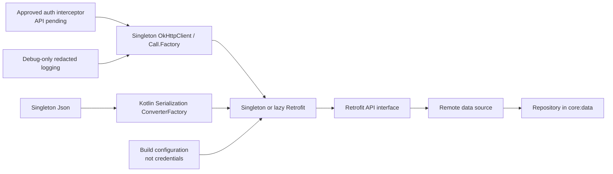

# Resonote Architecture

> 状态：架构参考基线；阶段 1 已完成，阶段 2 已完成 Foundation、06A 与 06B-1 纵向切片
> 更新日期：2026-08-11
> 参考项目：Now in Android（NIA）
> 参考提交：[`7d45eae4f8720a0c77f507712ba2437ff974b6ed`](https://github.com/android/nowinandroid/tree/7d45eae4f8720a0c77f507712ba2437ff974b6ed)
> 架构决策：[ADR-0001](adr/0001-now-in-android-reference-baseline.md)

## 1. 目标与边界

本文提取 NIA 的架构、模块化、构建和测试实践，并定义它们如何用于后续搭建 Resonote。它不是 NIA 的复制清单：NIA 提供参考实现，Resonote 根据音乐产品职责建立自己的模块和公共接口。

本阶段只冻结以下内容：

- 分层、依赖方向、模块职责和模块拆分规则。
- 依赖库的选型原则，以及必须稳定优先的版本策略。
- 后续搭建顺序、质量门槛和参考源码入口。
- “首页 / 发现 / 我的”作为暂定顶层目的地；它们的业务含义和模块名尚未冻结。
- 播放域的模块、所有权和依赖边界；Controller 字段、队列持久化、音频焦点细节和服务协议尚未设计。

本阶段不定义服务端端点、认证方式、网络 DTO、数据库表、业务模型或播放协议。上述内容必须在 API 契约明确后补充 ADR，不能从 NIA 的资讯业务模型推导。

## 2. 参考源与阅读方式

### 2.1 固定参考

| 项目 | 位置 | 用途 |
|---|---|---|
| 本地 NIA 根目录 | 从 Resonote 根目录访问 `../nowinandroid` | 快速搜索和对照源码 |
| 固定上游快照 | `android/nowinandroid@7d45eae` | 可复现的模块与依赖证据 |
| NIA Architecture Learning Journey | [`docs/ArchitectureLearningJourney.md`](https://github.com/android/nowinandroid/blob/7d45eae4f8720a0c77f507712ba2437ff974b6ed/docs/ArchitectureLearningJourney.md) | 分层、UDF、离线优先与同步数据流 |
| NIA Modularization Learning Journey | [`docs/ModularizationLearningJourney.md`](https://github.com/android/nowinandroid/blob/7d45eae4f8720a0c77f507712ba2437ff974b6ed/docs/ModularizationLearningJourney.md) | 模块类型、依赖规则和 feature `api/impl` 拆分 |
| Android Architecture Recommendations | [Android Developers](https://developer.android.com/topic/architecture/recommendations) | 官方分层、Repository、Flow 和 UDF 原则 |
| Offline-first guidance | [Android Developers](https://developer.android.com/topic/architecture/data-layer/offline-first) | 本地事实源与同步策略 |

文中的 NIA 路径均相对于 `../nowinandroid`。永久链接以固定提交为准；`main` 只用于主动升级调研，不能静默改变本基线。

### 2.2 NIA 完整模块清单

固定提交的 `settings.gradle.kts` 包含以下 35 个 Gradle 模块：

```text
:app
:app-nia-catalog
:benchmarks
:core:analytics
:core:common
:core:data
:core:data-test
:core:database
:core:datastore
:core:datastore-proto
:core:datastore-test
:core:designsystem
:core:domain
:core:model
:core:navigation
:core:network
:core:notifications
:core:screenshot-testing
:core:testing
:core:ui
:feature:foryou:api
:feature:foryou:impl
:feature:interests:api
:feature:interests:impl
:feature:bookmarks:api
:feature:bookmarks:impl
:feature:topic:api
:feature:topic:impl
:feature:search:api
:feature:search:impl
:feature:settings:impl
:lint
:sync:work
:sync:sync-test
:ui-test-hilt-manifest
```

`build-logic` 是通过 `pluginManagement.includeBuild("build-logic")` 接入的 included build，不出现在上述 `include(...)` 列表，但属于架构基线。

### 2.3 MoeKoe 功能参考

NIA 继续是工程架构参考；MoeKoe 系列只用于识别产品能力、业务状态和已经验证过的 Android 风险。具体决策见 [ADR-0002](adr/0002-moekoe-functional-reference.md)。

| 参考源 | 固定提交 | 许可 | 使用方式 |
|---|---|---|---|
| 本地 `../MoeKoeMusic` | [`52c9833afe2e7fedcba8d5b23ff8d1f9731af73a`](https://github.com/MoeKoeMusic/MoeKoeMusic/tree/52c9833afe2e7fedcba8d5b23ff8d1f9731af73a) | GPL-2.0-only | 产品功能、页面入口、用户任务和状态语义参考；不复制 Vue/Electron 代码、样式或资产 |
| `../MoeKoeMusic/api` submodule | `6efe84e1971c15b11a5cf1a210c5e8e0cc9d7ddb` | MIT | API 能力与协议证据；只有逐文件确认来源、保留许可声明后才可选择性独立迁移 |
| 本地 `../MoeKoeMusic-Mobile-V2` | `c4b4f1d56c7484580444cf294914fe0601e120bd` | GPL-2.0-only | Android/Compose/Media3 风险、测试场景和迁移教训参考；不复制 Kotlin 实现 |

参考优先级固定为：Resonote 已冻结设计规范 → 已确认产品/API 契约 → Android 官方指导 → NIA 架构 → MoeKoe 功能语义。旧项目中的路由守卫、存储、依赖和页面组织不自动成为 Resonote 决策。

## 3. NIA 模块说明与源码索引

### 3.1 应用、构建与质量模块

| NIA 模块/目录 | 参考源码目录 | 职责 | 依赖方向 |
|---|---|---|---|
| `:app` | `app/` | 组合功能模块、`MainActivity`、App Scaffold、顶层导航和应用级状态 | 可依赖 feature `api/impl` 与所需 core；其他模块不得反向依赖 app |
| `:app-nia-catalog` | `app-nia-catalog/` | 独立运行设计系统和共享 UI 的组件目录 | 依赖 `core:designsystem`、`core:ui`，不承载产品逻辑 |
| `:benchmarks` | `benchmarks/` | Macrobenchmark、启动性能测试和 Baseline Profile 生成 | 以目标 app 为被测对象，不成为生产依赖 |
| `build-logic` | `build-logic/` | Included build；提供单一职责、可组合的 Convention Plugins | 统一 Android、Kotlin、Compose、Hilt、Room、测试和质量配置 |
| `:lint` | `lint/` | 项目自定义 Android Lint 规则及测试 | 由需要发布规则的模块通过 `lintPublish` 使用 |
| `:ui-test-hilt-manifest` | `ui-test-hilt-manifest/` | 为 Hilt UI/Robolectric 测试提供独立 Manifest 宿主 | 仅测试/调试配置依赖 |

根目录的 `gradle/libs.versions.toml` 是依赖坐标、版本和插件别名的唯一目录。通用构建配置进入 Convention Plugin；模块独有配置保留在模块自己的 `build.gradle.kts`，不为单个模块制造通用插件。

### 3.2 Core 模块

| NIA 模块 | 参考源码目录 | 职责 | Resonote 判断 |
|---|---|---|---|
| `:core:analytics` | `core/analytics/` | Analytics 接口和实现边界 | 排除；未经明确批准不加入遥测或事件上报 |
| `:core:common` | `core/common/` | Dispatcher、通用结果/同步工具等跨模块基础能力 | 采用，但只放真正跨域且无合适所有者的代码 |
| `:core:model` | `core/model/` | 跨数据层和 UI 层使用的公开领域模型 | 采用为纯 Kotlin/JVM 模块，不放 DTO、Entity 或 Android UI 类型 |
| `:core:network` | `core/network/` | Retrofit API、OkHttp、网络数据源、Network DTO 与映射 | 采用；具体 API 和认证待后端契约明确 |
| `:core:database` | `core/database/` | Room Database、Entity、DAO 和 Migration | 采用；Entity 只在数据层边界内可见 |
| `:core:datastore-proto` | `core/datastore-proto/` | Proto schema 与生成类型 | 采用，用于非关系型偏好设置 |
| `:core:datastore` | `core/datastore/` | Proto DataStore、序列化与偏好数据源 | 采用，不用它代替关系型媒体数据存储 |
| `:core:data` | `core/data/` | Repository 接口/实现，协调网络、数据库与 DataStore | 采用；是其他层访问应用数据的唯一入口 |
| `:core:domain` | `core/domain/` | 可复用或复杂的 Use Case | 按需采用；简单转发不得机械包装成 Use Case |
| `:core:navigation` | `core/navigation/` | Navigation 3 keys、back stack 与导航基础设施 | 采用；业务 destination key 归各 feature `api` 所有 |
| `:core:designsystem` | `core/designsystem/` | Theme、Token、原子组件与图标 | 采用；实现必须以现有冻结设计规范为权威源 |
| `:core:ui` | `core/ui/` | 依赖 `core:model` 的跨 feature 复合 UI | 采用；不重复定义 design system 原子组件 |
| `:core:notifications` | `core/notifications/` | NIA 的内容通知能力 | 不直接采用；播放通知归未来 playback 域，其他通知有需求时再建 |
| `:core:testing` | `core/testing/` | 通用 test doubles、rules、dispatcher 和测试工具 | 采用；优先 fake 实现而非基于调用验证的 mocks |
| `:core:data-test` | `core/data-test/` | 可替换 Repository、测试数据与数据层 fixtures | 数据纵切片阶段采用 |
| `:core:datastore-test` | `core/datastore-test/` | 内存 DataStore 和 Hilt 测试替换 | DataStore 引入时采用 |
| `:core:screenshot-testing` | `core/screenshot-testing/` | Roborazzi 截图、设备矩阵和无障碍检查支持 | Design System 阶段采用，并服务 `design/VALIDATION.md` |

Core 模块可以依赖更底层的 Core 模块，但不得依赖 feature 或 app。`core:common` 不是杂物箱；代码只有在至少两个消费者共享且无法归属明确领域时才进入该模块。

### 3.3 Feature 模块

| NIA 模块 | 参考源码目录 | 职责 |
|---|---|---|
| `:feature:foryou:api` | `feature/foryou/api/` | For You 导航 key 和跨 feature 入口 |
| `:feature:foryou:impl` | `feature/foryou/impl/` | For You UI、ViewModel、内部状态与交互 |
| `:feature:interests:api` | `feature/interests/api/` | Interests 导航公共面 |
| `:feature:interests:impl` | `feature/interests/impl/` | Interests 功能实现 |
| `:feature:bookmarks:api` | `feature/bookmarks/api/` | Bookmarks 导航公共面 |
| `:feature:bookmarks:impl` | `feature/bookmarks/impl/` | Bookmarks 功能实现 |
| `:feature:topic:api` | `feature/topic/api/` | Topic 导航公共面 |
| `:feature:topic:impl` | `feature/topic/impl/` | Topic 详情功能实现 |
| `:feature:search:api` | `feature/search/api/` | Search 导航公共面 |
| `:feature:search:impl` | `feature/search/impl/` | Search UI、状态和查询逻辑 |
| `:feature:settings:impl` | `feature/settings/impl/` | Settings 实现；NIA 当前没有单独的 settings `api` 模块 |

NIA 的功能名属于资讯产品，不复制到 Resonote。Resonote 只采用拆分规则：

- 每个需要被其他功能导航到的 feature 分为 `api` 和 `impl`。
- `api` 只暴露稳定的 Navigation 3 key、必要参数和跨功能入口，不依赖其他 feature。
- `impl` 承载 Composable、ViewModel、UI State、内部组件和业务交互；可以依赖其他 feature 的 `api`，不得依赖其 `impl`。
- 只被一个 feature 使用的类型留在该 feature；确有多个消费者时才提升到合适的 core。
- “首页 / 发现 / 我的”当前只冻结产品标签。API 评审完成前，不冻结 `home`、`discover`、`library`、`profile` 或 `mine` 等内部模块名。

### 3.4 同步模块

| NIA 模块 | 参考源码目录 | 职责 | Resonote 判断 |
|---|---|---|---|
| `:sync:work` | `sync/work/` | WorkManager Worker、同步初始化、约束、退避与状态监控 | 数据纵切片稳定后采用；只同步允许离线持久化的数据 |
| `:sync:sync-test` | `sync/sync-test/` | 同步器和 Worker 的 test doubles/测试工具 | 与 `sync:work` 同期采用 |

WorkManager 负责可延迟、保证执行的后台同步，不承担播放服务、立即响应的用户操作或进程内短任务。

## 4. Resonote 目标架构

### 4.1 分层和依赖



强制依赖规则：

1. `app` 是组合根，不拥有业务数据访问实现。
2. UI 不直接调用 Retrofit、OkHttp、DAO 或 DataStore。
3. Repository 是数据层公共入口；网络、数据库和偏好数据源保持内部实现细节。
4. `core:model` 不依赖 Android UI、Retrofit、Room 或 feature。
5. `core:designsystem` 不依赖业务模型；依赖模型的复合组件进入 `core:ui`。
6. Domain 是可选层，只承载跨 ViewModel 复用或足够复杂的业务组合。
7. Core、sync 和 playback 不依赖 feature；feature `api` 不依赖 feature；feature `impl` 不互相依赖。

### 4.2 数据流与单一事实源



- 读取默认来自 Room/DataStore 并以 `Flow` 暴露；远端响应先持久化，再由本地流驱动 UI。
- 写入使用 `suspend` API，并明确本地优先、在线优先或排队写入语义；具体策略由 API 与产品需求决定。
- 同步失败属于同步状态，不把仍可读取的本地数据误报为页面无内容。
- Network DTO、Database Entity、Proto 类型分别停留在其数据源边界，映射后才能成为 `core:model` 类型。
- ViewModel 通过 `StateFlow` 暴露不可变 UI State，Compose 使用生命周期感知方式收集。
- Loading、Content、Empty、Error、Offline、Permission denied 必须按 `design/VALIDATION.md` 区分，不能折叠为一个布尔状态。

### 4.3 公共接口约定

以下是签名形态约束，不是业务 API：

```kotlin
interface ExampleRepository {
    fun observeItems(query: ExampleQuery): Flow<List<Example>>
    suspend fun update(command: ExampleCommand)
}

sealed interface ExampleUiState {
    data object Loading : ExampleUiState
    data class Success(val items: List<ExampleUiModel>) : ExampleUiState
    data class Error(val recoverable: Boolean) : ExampleUiState
}
```

- 实际名称、字段、错误类型和写入语义必须来自 API/产品契约，不得照抄示例。
- Repository 接口应按领域能力组织，不能按 Retrofit endpoint 一一镜像。
- One-off UI effects 只用于导航、Snackbar 等一次性消费事件；持久页面内容必须进入 UI State。
- 错误应在能够恢复或转换语义的边界处理，并保留可测试的显式失败路径。

### 4.4 Resonote 音乐域边界

NIA 没有音乐播放实现，以下模块是 Resonote 的扩展架构。Android 官方建议后台播放把 `Player` 与 `MediaSession` 放入 [`MediaSessionService`](https://developer.android.com/media/media3/session/background-playback)；UI 通过 Controller 与 Session 通信，而不是持有 Service 或 ExoPlayer。

| 目标模块 | 状态 | 职责 | 允许依赖 | 禁止暴露/依赖 |
|---|---|---|---|---|
| `:core:playback:api` | 架构冻结，字段待定 | `PlaybackController`、不可变播放状态、播放命令、队列状态的应用内合同 | `core:model`、Coroutines/Flow | Media3 `Player`、`MediaItem`、`SessionToken`、Android Service 类型 |
| `:core:playback:test` | 与 playback api 同期创建 | Fake PlaybackController、可控时钟、队列与状态 fixtures | playback api、Coroutines Test、Turbine | ExoPlayer、真实 Service、网络与磁盘 |
| `:core:playback:service` | Playback 阶段创建 | ExoPlayer、MediaSessionService、音频焦点、系统控制、播放通知、恢复与 Media3 映射 | playback api、data/model、media cache、Media3 ExoPlayer/Session、Hilt | feature、Compose、Navigation、Player 产品 UI |
| `:core:media:local` | 本地音乐纵切片创建 | SAF/MediaStore/ContentResolver 来源读取、受控复制、哈希与媒体元数据提取 | common/model、Android storage/media API、Coroutines | DAO、Repository、Player、UI、外部 URI 进入稳定领域模型 |
| `:core:media:cache` | 流媒体方案确定后创建 | 共享媒体 `DataSource.Factory`、流式缓存、稳定 cache key 与容量/淘汰策略 | core network、Media3 DataSource/Database/OkHttp | Retrofit API、Repository、UI、永久下载状态 |
| `:core:media:download` | 离线下载获批后创建 | DownloadManager/DownloadService、DownloadIndex、下载状态和永久媒体缓存 | data/model、media cache、Media3 ExoPlayer/WorkManager | 把下载当普通 `sync:work`、向 UI 暴露 Media3 Download 类型 |
| `:feature:player:api` | Player IA 确认后创建 | Player destination key 与必要导航参数 | core navigation | Media3、Service、Repository 实现 |
| `:feature:player:impl` | Player 设计冻结后创建 | Full Player、MiniPlayer、进度、歌词/封面 Pager、Queue Sheet 的 Compose UI 与 ViewModel | player api、playback api、designsystem/ui、model，按需 data/domain | ExoPlayer、MediaSessionService、媒体网络/缓存实现 |

音乐数据的归属规则：

- Track、Album、Artist、Playlist、Lyrics 等公共业务模型进入 `core:model`；Network DTO、Room Entity 和 Media3 `MediaItem` 各自留在 network、database、playback service 内。
- 媒体目录、收藏、歌单、播放历史和歌词数据仍通过 `core:data` Repository 提供；不先建立无边界的 `core:music` 聚合模块。Repository 是否拆成 catalog/library/lyrics 子模块由 API 规模决定。
- Queue 是当前 Session/Player 的有序播放状态，由 playback api 暴露，不建立第二套 Room 队列事实源。只有“保存队列/跨设备同步”成为明确产品能力时，才在 data 层建立持久模型。
- Lyrics 默认是 Player feature 内的页面/组件；只有成为可从多个 feature 独立导航的目的地时才拆 `feature:lyrics:api/impl`。歌词解析、时间轴匹配属于 domain/data，不进入 designsystem。
- Download 与流式 LRU Cache 语义不同：前者由用户显式管理且不可被自动淘汰，后者是可回收性能缓存。二者可共享上游 DataSource，但不能共享淘汰策略或状态模型。
- MiniPlayer 属于 Player 产品 UI，不进入 `core:designsystem`；App Scaffold 可以组合 `feature:player:impl` 提供的入口，但只通过 playback api 观察状态。
- 音频焦点、播放通知和 MediaSession 生命周期由 playback service 共同拥有。NIA 的 `core:notifications` 不能作为播放通知模板。
- 当前冻结模块职责和依赖方向，不冻结 Controller 字段、缓存容量、音频格式、认证 Header、队列持久化或歌词协议；这些由 API 与 Player ADR 决定。

### 4.5 MoeKoe 功能到 Resonote 模块映射

下表是功能候选清单，不等于首版承诺。只有“架构处理”列明确为基线的模块才进入当前目标图；需要 API、合规或产品决策的能力保持 Deferred。

| 旧产品能力 | 参考源码 | Resonote 架构处理 | 主要依赖/边界 | 状态 |
|---|---|---|---|---|
| 首页推荐 | `src/views/Home.vue`、`src/components/home/` | 候选 `:feature:home:api/impl`；Repository 提供缓存内容，歌曲操作通过 playback api | data/domain、model、ui/designsystem、Coil | 顶层标签已暂定；内容待 API |
| 发现、排行榜、新歌、新专辑、推荐歌单 | `src/views/Discover.vue`、`src/components/discover/`、`src/views/Ranking.vue` | 候选 `:feature:discover:api/impl`；排行榜先作为 Discover 子目的地，不单独建模块 | data/domain、model、ui、Coil | 待 API/IA |
| 我的/资料库 | `src/views/Library.vue` | 保留“我的”顶层标签；登录资产、本地音乐和设置采用聚合导航，不让聚合页拥有所有数据 | auth/library/local repositories、feature api | 语义待 API |
| 搜索与建议 | `src/views/Search.vue`、`RecommendedSearch.vue`、`components/search/` | 候选 `:feature:search:api/impl`；综合/单曲/歌单/专辑/歌手为内部结果类型 | data/domain、model、ui；分页库按 API 决定 | 待 API |
| 本地音乐与外部文件 | `src/views/LocalMusic.vue`；Mobile V2 `feature/localmusic` | `:feature:localmusic:api/impl` + `:core:media:local`；SAF/MediaStore 只作来源，App 私有副本/索引为事实源的方案需单独 ADR | data/database、WorkManager、playback api、ContentResolver | 音乐 App 基线候选 |
| 登录、二维码、手机/密码、风险验证 | `src/views/Login.vue`；Mobile V2 `feature/login` | `:feature:login:api/impl`；session/auth Repository 属 data，provider 协议属 platform adapter | DataStore、Android Keystore；ZXing/WebKit 仅真实流程需要时加入 | 待认证 API/安全审计 |
| 歌单/专辑/歌手详情 | `src/views/PlaylistDetail.vue` | `:feature:playlist:api/impl` 先承载可复用集合详情；若专辑/歌手差异扩大再拆 feature | data/domain、model、playback api、navigation | 待 API/IA |
| 用户资料 | Library 资料入口；Mobile V2 `feature/profile` | `:feature:profile:api/impl`，允许从“我的”、搜索和内容作者入口复用 | user repository、model、ui/navigation | 待账号 API |
| 设置、主题、语言、缓存管理 | `src/views/Settings.vue`、`src/config/settings.js` | `:feature:settings:impl`；设置值通过 Repository/DataStore，只有真实消费者存在才显示选项 | datastore/data、designsystem；系统 per-app locale 按需 | 基础设置候选 |
| Player、MiniPlayer、Queue、歌词 | `src/components/player/`、`src/views/Lyrics.vue` | 使用 4.4 节 playback 与 player feature 分层；Queue/Lyrics 默认不独立成 feature | playback api/service、lyrics repository、player impl | 架构边界已冻结，产品待设计 |
| 云盘 | `src/views/CloudDrive.vue` | 独立 `:feature:cloud:api/impl` 候选；远端文件与本地下载不得混为同一模型 | provider adapter、data、download/playback api | Deferred |
| 听歌识曲 | `src/views/Recognize.vue`、`src/utils/recognize.js` | 独立 `:feature:recognition:api/impl` 候选；录音采集与识别协议隔离 | microphone permission、audio capture、provider adapter | Deferred，需隐私审计 |
| MV/视频播放 | `src/views/VideoPlayer.vue` | 独立 `:feature:video:api/impl` 候选；是否复用音乐 Session 由视频 ADR 决定 | Media3 video/UI、PiP 按需 | Deferred |
| 收藏、创建/编辑歌单、播放历史 | Playlist/Library 操作与相关 API modules | Repository 能力，按所属页面组合；写入必须定义远端权威、乐观更新与冲突恢复 | data/database/sync、session | 待 API |
| 每日 VIP 领取 | README/API `youth_day_vip*` | 不进入默认模块或后台任务 | 需要服务条款、账号安全和合规批准 | 排除，除非单独授权 |
| 评论/社交 | API modules 中的 comment/follow | 旧产品声明“无社交”，不因 Endpoint 存在而建模块 | 无 | 排除，除非产品范围改变 |
| 插件、PWA、桌面歌词、Touch Bar、全局快捷键、Electron 更新 | PC 专属组件与 Electron | 不迁移到 Android 架构；Android 平台有独立需求时重新设计 | 不继承 Electron/Vue 依赖 | 排除 |

拆分规则：

- 顶层目的地不等于一个巨型模块。“我的”可以组合 profile、localmusic、settings、cloud 等 feature API，但不得直接拥有它们的 Repository 实现。
- 页面只是同一领域的不同筛选或详情时，先保留在同一 feature；只有可被多个来源独立导航、团队并行或依赖明显不同才拆模块。
- 按 NIA 结构，Provider 专属签名、加密、Cookie、Network DTO 和 Endpoint 进入 `core:network`，并以 `protocol`、`model`、`retrofit` 等内部 package 隔离；不建立额外的 `platform` 模块。
- `core:data` 通过 provider 接口组合远端与本地，不向 feature 暴露 provider DTO、Cookie、短期播放 URL 或服务端错误字符串。
- 旧代码展示的功能不代表 Endpoint 当前可用，也不代表服务条款允许；每条真实纵切片都必须重新验证协议、权限、错误和合规边界。

## 5. NIA 到 Resonote 的采用矩阵

| NIA 能力 | Resonote 处理 | 引入阶段 |
|---|---|---|
| `build-logic`、Version Catalog、类型安全 project accessors | 采用并改用 Resonote plugin id | 1. 构建系统 |
| `core:designsystem`、catalog app、截图测试 | 采用；以现有冻结设计文档为规范源 | 2. Design System/Catalog |
| `app`、`core:navigation`、adaptive scaffold | 采用结构；顶层目的地暂为“首页 / 发现 / 我的” | 3. App Shell |
| `core:model/network/database/datastore/data` | 采用边界；模型与 schema 等 API 明确后定义 | 4. 数据纵切片 |
| `core:common/domain/ui` | 按实际复用和复杂度引入 | 4–5 |
| feature `api/impl` | 采用规则；不复制 NIA 的 feature 名称 | 5. Feature 模块 |
| `sync:work`、`sync:sync-test` | 数据同步需求明确后采用 | 6. Sync/Benchmark |
| `benchmarks`、Baseline Profile | 首条关键用户路径稳定后采用 | 6. Sync/Benchmark |
| `lint` | 有 Resonote 专属可自动检查规则时采用 | 2 起按需 |
| Hilt 测试 Manifest、testing/data-test/datastore-test | 随对应生产能力一起建立 | 各阶段同步 |
| `core:analytics`、Firebase Analytics/Crashlytics/Performance | 排除；不加入遥测或网络上报 | 不计划 |
| `core:notifications` | 不直接采用；普通通知按需求评审，播放通知归 playback | 待定 |
| Media3 playback | NIA 无对应实现；Resonote 使用 playback api/service、media cache/download 与 player feature 分层 | 7. Playback |

## 6. 依赖选择与版本策略

### 6.1 批准的库族

| 能力 | 选择 | 约束 |
|---|---|---|
| UI | Jetpack Compose + Material3 | `androidx.compose.material3:material3:1.4.0` 是冻结基线；不使用 1.5 Alpha/Expressive API |
| 导航 | Navigation 3 | 优先稳定 Core；需要 Alpha/RC 的 adaptive bridge 时必须新增 ADR |
| 依赖注入 | Hilt + KSP | 生产实现通过接口绑定；测试可替换模块或构造注入 |
| 并发/响应式 | Kotlin Coroutines + Flow | Dispatcher 可注入；禁止业务层硬编码不可控 Scope |
| 网络 | OkHttp3 + Retrofit2 | OkHttp 管理传输/拦截器，Retrofit 声明 API；日志不得泄露凭证或个人数据 |
| JSON | kotlinx.serialization | DTO 显式建模，忽略未知字段等策略在 API 契约阶段冻结 |
| 关系数据 | Room | 本地可观察事实源、事务、Migration 和 DAO 测试 |
| 偏好 | Proto DataStore | 用于主题、偏好和小型结构化状态，不存媒体目录 |
| 后台同步 | WorkManager | 约束、唯一工作、指数退避和可测试 Worker |
| 图片 | Coil | 请求尺寸匹配渲染尺寸，遵循 Foundation Artwork 规则 |
| 音乐播放 | AndroidX Media3 | ExoPlayer + Session；DataSource/Download/格式模块按需添加且全套同版本 |
| 测试 | Kotlin Test/JUnit、Truth、Turbine、Robolectric、Roborazzi、Compose UI Test | 优先行为测试和 fake，不依赖脆弱的调用顺序 mock |
| 性能 | Macrobenchmark + Baseline Profile | 关键路径稳定后引入和生成 |
| 质量 | Android Lint、Spotless、Dependency Guard | CI 中执行；格式化与依赖快照变化必须可审阅 |

除 Material3 `1.4.0` 外，本文冻结库族而不冻结 Resonote 的最终版本。创建工程前必须生成一份完整兼容矩阵，验证 AGP、Gradle、JDK、Kotlin、KSP、Compose Compiler、Compose BOM 和 AndroidX 的组合；所有版本统一维护在 `gradle/libs.versions.toml`。

### 6.2 Gradle 依赖范围规则

| 范围 | 使用条件 | 禁止用法 |
|---|---|---|
| `api` | 当前模块的公共签名暴露了该依赖的类型，消费者编译时必须可见 | 仅为省事传播整个依赖树 |
| `implementation` | 默认选择；依赖只参与当前模块实现 | 公共签名实际暴露其类型却仍声明为 `implementation` |
| `ksp` | Hilt、Room 等编译期代码生成器 | 将 compiler 放入运行时 classpath |
| `testImplementation` | JVM 单元测试、fake、Flow 和序列化测试 | 生产代码依赖测试工具 |
| `androidTestImplementation` | 设备/模拟器上的 Room、Compose UI、WorkManager 测试 | 可由更快 JVM 测试完成的全部逻辑 |
| `lintPublish` | 从 library 向消费者发布 Resonote Lint 规则 | 普通运行时依赖 |

模块默认使用 `implementation`。只有公共接口确实暴露依赖类型时才使用 `api`，并在 code review 中说明暴露原因。Convention Plugin 添加的依赖也属于模块依赖合同，模块 README/依赖图必须将其计算在内。

### 6.3 模块级依赖蓝图

下表是后续创建 Resonote 工程时的起点。NIA 的实际声明用于说明参考来源；Resonote 列描述目标边界，具体业务依赖仍以首个数据纵切片为准。

| 模块 | 项目依赖 | 外部依赖与插件 | 依赖说明 |
|---|---|---|---|
| `:app` | `implementation` 各 feature `api/impl`、navigation、designsystem/ui、data、sync-work、playback-service；`baselineProfile(:benchmarks)` | Android Application/Compose/Hilt Convention、Activity Compose、Navigation 3 UI、Material3/Adaptive、Lifecycle Runtime、SplashScreen、ProfileInstaller；Hilt Compiler（`ksp`） | 组合根和 Manifest 所有者；不声明 Retrofit、Room、Media3 ExoPlayer 等具体实现库 |
| `:app-resonote-catalog` | `implementation` designsystem、ui | Android Application/Compose Convention、Compose Tooling、Roborazzi 测试依赖 | 独立组件目录，不依赖 data、feature 或 playback service |
| `build-logic` | 无生产 project dependency | AGP Gradle API、Kotlin/Compose/KSP/Room/Spotless 等 Gradle Plugin artifact | Included build；Convention Plugin 只组合共同配置和依赖，不承载业务代码 |
| `:lint` | 无生产 project dependency | Android Lint API、Checks、Tests | 发布 Resonote 自定义规则；由 designsystem 等模块通过 `lintPublish` 消费 |
| `:ui-test-hilt-manifest` | 无 | Android Library Plugin；测试 Manifest 所需最小依赖 | 仅 debug/test fixture 使用，不打入 release runtime |
| `:core:common` | 无 | Coroutines Core；Hilt Core 仅在需要注入 Dispatcher 时加入 | 纯 Kotlin/JVM；公共 Dispatcher qualifier 或通用同步协议可从这里暴露 |
| `:core:model` | 无 | Kotlinx DateTime（模型确有时间字段时） | 纯 Kotlin/JVM；不依赖 Retrofit、Room、Compose 或 Android SDK |
| `:core:network` | 默认 `implementation(:core:common)`；不向 feature 传播 | Kotlin Serialization JSON、OkHttp、Logging Interceptor、Retrofit、Retrofit Kotlin Serialization Converter；Hilt + KSP | 只负责远端数据源、DTO、传输配置和网络错误；详见 6.4 |
| `:core:database` | `implementation(:core:model)` 仅在 mapper 需要；DAO 不直接暴露领域模型 | Room Runtime、Room KTX、Room Compiler（`ksp`）、Kotlinx DateTime | Entity/DAO/Migration 留在数据库边界；数据库测试使用真实 in-memory Room |
| `:core:datastore-proto` | 无 | Protobuf Gradle Plugin、Protoc、Protobuf Kotlin Lite（`api`） | 生成 lite Java/Kotlin 类型；schema 变更必须考虑兼容性 |
| `:core:datastore` | `implementation(:core:common)`、`implementation(:core:datastore-proto)`、按需 `implementation(:core:model)` | AndroidX DataStore、Coroutines Test | 偏好数据源和 Proto/领域映射；不得存储媒体目录或大列表 |
| `:core:data` | `api(:core:model)`；`implementation` network/database/datastore/common | Coroutines、Hilt + KSP；序列化只用于数据层确有需要的测试/fixture | Repository 接口与实现；隐藏 DTO、Entity、DAO 和 DataStore 类型 |
| `:core:domain` | 通常 `api(:core:model)`、`implementation(:core:data)` | `javax.inject` 或 Hilt | 只添加可复用/复杂 Use Case；不为每个 Repository 方法建立空包装 |
| `:core:navigation` | 无 | Navigation 3 Runtime（公共 key 使用时为 `api`）、SavedState Compose、Lifecycle ViewModel Navigation3 | 提供导航基础设施；feature destination key 归各 feature `api` |
| `:core:designsystem` | 不依赖业务模块 | Compose Foundation、Material3 `1.4.0`、UI/Runtime、官方图标；Roborazzi/Robolectric 仅测试使用 | Theme、Token 和原子组件；不得依赖 `core:model` 或网络图片模型 |
| `:core:ui` | `api`/`implementation` designsystem、model，按公共签名决定 | Coil Compose、Compose UI | 共享的业务复合组件；图片加载不要求 `core:network` 拥有 Coil |
| `:feature:<name>:api` | `api(:core:navigation)` | Navigation 3 Runtime 由 navigation 暴露 | 只包含 navigation key、必要参数和入口合同 |
| `:feature:<name>:impl` | `implementation` 自身 api、core UI/designsystem，以及实际需要的 data/domain；只能依赖其他 feature `api` | Compose、Lifecycle Runtime/ViewModel Compose、Hilt ViewModel、Navigation 3 Runtime；测试用 Compose UI/Core Testing | Convention Plugin 提供共同依赖，模块脚本只声明功能特有依赖 |
| `:sync:work` | `implementation(:core:data)` | WorkManager KTX、Hilt Work、AndroidX Hilt Compiler（`ksp`）、WorkManager Testing | 不采用 NIA 的 Firebase Messaging、Analytics 或 Notifications 依赖 |
| `:core:playback:api` | `api(:core:model)` | Coroutines Core/Flow | 面向 UI 的 Media3-free 播放合同；不能暴露 Media3 或 Service 类型 |
| `:core:playback:test` | `api(:core:playback:api)` | Coroutines Test、Turbine | Fake controller、可控时钟与播放状态 fixtures；供 Player/ViewModel 测试使用 |
| `:core:playback:service` | `implementation` playback-api、data、model、media-cache | Media3 ExoPlayer、Session、按协议选择 HLS/DASH；Hilt + KSP；Media3 Test Utils 仅测试使用 | 唯一持有 Player/Session 的生产模块；系统播放通知也归这里 |
| `:core:media:local` | `implementation` common/model | Android ContentResolver/MediaMetadataRetriever、Coroutines；测试使用 Robolectric/受控 fixture | 读取来源、复制、哈希和元数据，不访问 Room 或播放服务 |
| `:core:media:cache` | `implementation` core-network | Media3 DataSource、Database、DataSource OkHttp | 向 playback/download 提供共享 DataSource/Cache，不暴露给 feature |
| `:core:media:download` | `implementation` data、model、media-cache | Media3 ExoPlayer、ExoPlayer WorkManager、WorkManager、Media3 Test Utils | 可选永久下载能力；不与普通数据同步 Worker 混用 |
| `:feature:player:api` | `api(:core:navigation)` | Navigation 3 Runtime | Player destination 合同；不暴露 Player/Session |
| `:feature:player:impl` | `implementation` player-api、playback-api、designsystem、ui、model，按需 data/domain | Compose、Lifecycle、Hilt ViewModel；默认不直接依赖 Media3 UI | Full Player、MiniPlayer、Queue 和 Lyrics 产品 UI |
| `:core:testing` | 按 fake 公共签名依赖 common/model/data | Coroutines Test、AndroidX Test Rules、Hilt Android Testing | 只暴露跨模块测试工具；不把无关生产模块聚合进测试 classpath |
| `:core:data-test` | `api(:core:data)` | Hilt Android Testing | Repository fake 和 fixtures；随数据纵切片建立 |
| `:core:datastore-test` | `implementation` common/datastore | Hilt Android Testing | 内存 DataStore 与测试替换模块 |
| `:core:screenshot-testing` | `implementation(:core:designsystem)` | Compose UI Test、Roborazzi、Roborazzi Accessibility Check、Robolectric | 统一设备、主题、字号与无障碍截图工具 |
| `:sync:sync-test` | `implementation` data/sync-work | Hilt Android Testing、WorkManager Testing | Worker、Synchronizer 和调度状态的 fake/测试工具 |
| `:benchmarks` | 目标 `:app` | Macrobenchmark、UI Automator、Baseline Profile Plugin | 仅测试工程使用，不能成为生产依赖 |

与 NIA 的关键差异：

- NIA 的 `core:network` 同时提供 Coil `ImageLoader`，因此依赖 `coil`、`coil-svg`；Resonote 默认把图片加载装配放在 `core:ui` 或后续独立图片模块，避免 network 同时拥有 REST 与 UI 图片职责。
- NIA 的 `core:data` 使用 `api` 暴露 database、datastore 和 network。Resonote 默认改为 `implementation`，仅将 Repository 公共签名需要的 `core:model` 暴露为 `api`，防止 feature 绕过 Repository 访问数据源。
- NIA 的 Hilt Convention Plugin 自动加入 `hilt-android`/`hilt-core` 与 `hilt-compiler`；Resonote 沿用该方式，模块中不重复声明。
- NIA 的 `sync:work` 依赖 Analytics、Notifications 和生产 flavor 的 Firebase Messaging；Resonote 不引入这些依赖。

### 6.4 Network 依赖与装配

#### 6.4.1 Version Catalog 坐标

以下别名明确组成 `OkHttp3 + Retrofit2 + kotlinx.serialization` 网络栈。版本号由实施前兼容矩阵填写；表 6.5 的 NIA 版本仅作为候选证据。

```toml
[libraries]
okhttp-core = { module = "com.squareup.okhttp3:okhttp", version.ref = "okhttp" }
okhttp-logging = { module = "com.squareup.okhttp3:logging-interceptor", version.ref = "okhttp" }
okhttp-mockwebserver = { module = "com.squareup.okhttp3:mockwebserver", version.ref = "okhttp" }
retrofit-core = { module = "com.squareup.retrofit2:retrofit", version.ref = "retrofit" }
retrofit-kotlin-serialization = { module = "com.squareup.retrofit2:converter-kotlinx-serialization", version.ref = "retrofit" }
kotlinx-serialization-json = { module = "org.jetbrains.kotlinx:kotlinx-serialization-json", version.ref = "kotlinxSerializationJson" }
```

NIA 只显式声明 `logging-interceptor` 并通过它传递获得 OkHttp Core。Resonote 应显式声明 `okhttp-core`，不把必要的编译依赖建立在传递依赖上。NIA 的 `retrofit-kotlinx-serialization-json = "1.0.0"` 版本项没有被实际 converter alias 使用；其 alias 跟随 Retrofit `2.11.0`，Resonote 不保留这个无效版本键。

#### 6.4.2 `:core:network` 构建依赖形态

```kotlin
plugins {
    alias(libs.plugins.resonote.android.library)
    alias(libs.plugins.resonote.hilt)
    alias(libs.plugins.kotlin.serialization)
}

dependencies {
    implementation(projects.core.common)

    implementation(libs.kotlinx.serialization.json)
    implementation(libs.okhttp.core)
    implementation(libs.okhttp.logging)
    implementation(libs.retrofit.core)
    implementation(libs.retrofit.kotlin.serialization)

    testImplementation(libs.kotlinx.coroutines.test)
    testImplementation(libs.okhttp.mockwebserver)
    testImplementation(libs.turbine)
}
```

Hilt Convention Plugin 统一添加 `implementation(hilt-android)` 和 `ksp(hilt-compiler)`；因此上例不重复声明。若网络公共接口确实暴露 `core:common` 或 `core:model` 类型，经过接口评审后才能把对应依赖改为 `api`。

#### 6.4.3 运行时装配链



- 单例 `Json` 同时用于 Retrofit converter 和需要相同协议规则的显式序列化；具体 `ignoreUnknownKeys`、枚举兼容和缺失字段策略在 API 契约阶段冻结。
- 单例 `OkHttpClient` 或 `Call.Factory` 负责连接池、超时、拦截器和缓存策略；Retrofit 不自行创建第二个 Client。
- 可沿用 NIA 的 `dagger.Lazy<Call.Factory>`，避免 Hilt 图初始化时在主线程过早创建 OkHttp。
- Base URL 可来自非敏感构建配置；Token、Cookie、密码和私钥不得写入 `BuildConfig`、Version Catalog、`local.properties` 示例或仓库。
- Logging Interceptor 只在 debug 构建启用，并对 `Authorization`、`Cookie` 等 Header 脱敏；认证响应和媒体二进制 Body 不记录。Release 不安装日志拦截器。
- 认证 interceptor、token refresh、certificate pinning、HTTP cache 和业务重试均等待服务端契约；Retrofit/OkHttp 层不得擅自重试非幂等写入。
- 网络异常在 remote data source/data 层转换为项目错误语义；HTTP/IO/serialization 类型不直接进入 ViewModel。

#### 6.4.4 网络测试合同

- 使用 MockWebServer 验证 URL、method、query/body、Header、converter、成功响应与 HTTP 错误，不请求真实服务。
- 分别覆盖 malformed JSON、未知字段、空 Body、超时、断网、取消和服务器错误。
- 验证 Release 图不包含 Logging Interceptor，敏感 Header 在 debug 日志中已脱敏。
- Repository 测试使用 fake remote/local data source；只在 network 模块测试 Retrofit/OkHttp 细节。

### 6.5 NIA 固定快照的版本证据

以下数据只用于理解参考源码，不代表 Resonote 已批准使用：

| 依赖 | NIA 快照版本 | Resonote 处理 |
|---|---:|---|
| Android Gradle Plugin | `9.0.0` | 实施时验证稳定兼容矩阵 |
| Kotlin | `2.3.0` | 实施时与 Compose/KSP 联合验证 |
| KSP | `2.3.4` | 实施时与 Kotlin 联合验证 |
| Compose BOM | `2025.09.01` | 不覆盖 Material3 `1.4.0` 冻结基线 |
| Compose Foundation | `1.8.0-alpha07` | 不直接采用 Alpha |
| Material3 Adaptive | `1.1.0-rc01` | 不直接采用 RC |
| Material3 Adaptive Navigation3 | `1.3.0-alpha04` | 不直接采用 Alpha |
| Navigation 3 | `1.0.0` | 稳定候选，仍需兼容性验证 |
| Hilt | `2.59` | 稳定候选 |
| Coroutines | `1.10.1` | 稳定候选 |
| kotlinx.serialization JSON | `1.8.0` | 稳定候选 |
| OkHttp | `4.12.0` | 采用库选型；版本在实施时确认 |
| Retrofit | `2.11.0` | 采用库选型；版本在实施时确认 |
| Room | `2.8.3` | 稳定候选 |
| DataStore | `1.2.0` | 稳定候选 |
| WorkManager | `2.10.0` | 稳定候选 |
| Coil | `2.7.0` | 采用库选型；实施时评估稳定主版本 |
| Robolectric | `4.16` | 测试基线候选 |
| Roborazzi | `1.56.0` | 截图测试基线候选 |
| Turbine | `1.2.0` | Flow 测试基线候选 |

任何 Alpha/RC 只能在满足以下条件后引入：稳定版无法实现已批准需求、有明确退出/升级方案、独立 ADR 记录风险，并完成相关截图、行为和兼容性回归。

### 6.6 Resonote 音乐模块依赖

Media3 不属于 NIA 参考快照。本节依据 Android 官方的 [Player 架构](https://developer.android.com/media/media3/session/player)、[后台播放](https://developer.android.com/media/media3/session/background-playback)、[网络栈与缓存](https://developer.android.com/media/media3/exoplayer/network-stacks)及[离线下载](https://developer.android.com/media/media3/exoplayer/downloading-media)定义 Resonote 扩展。2026-08-10 官方文档示例使用 Media3 `1.10.1`；它是实施候选，创建模块时仍需重新验证，且所有 Media3 artifact 必须使用同一版本。

#### 6.6.1 Media3 Version Catalog 坐标

```toml
[versions]
androidxMedia3 = "1.10.1" # 实施候选，创建模块时重新核对稳定版

[libraries]
androidx-media3-common = { module = "androidx.media3:media3-common", version.ref = "androidxMedia3" }
androidx-media3-exoplayer = { module = "androidx.media3:media3-exoplayer", version.ref = "androidxMedia3" }
androidx-media3-session = { module = "androidx.media3:media3-session", version.ref = "androidxMedia3" }
androidx-media3-datasource = { module = "androidx.media3:media3-datasource", version.ref = "androidxMedia3" }
androidx-media3-database = { module = "androidx.media3:media3-database", version.ref = "androidxMedia3" }
androidx-media3-datasource-okhttp = { module = "androidx.media3:media3-datasource-okhttp", version.ref = "androidxMedia3" }
androidx-media3-exoplayer-workmanager = { module = "androidx.media3:media3-exoplayer-workmanager", version.ref = "androidxMedia3" }
androidx-media3-exoplayer-hls = { module = "androidx.media3:media3-exoplayer-hls", version.ref = "androidxMedia3" }
androidx-media3-exoplayer-dash = { module = "androidx.media3:media3-exoplayer-dash", version.ref = "androidxMedia3" }
androidx-media3-ui-compose = { module = "androidx.media3:media3-ui-compose", version.ref = "androidxMedia3" }
androidx-media3-test-utils = { module = "androidx.media3:media3-test-utils", version.ref = "androidxMedia3" }
androidx-media3-test-utils-robolectric = { module = "androidx.media3:media3-test-utils-robolectric", version.ref = "androidxMedia3" }
```

不是所有坐标都默认加入：

- `media3-exoplayer` 与 `media3-session` 是后台音频播放的批准库族。
- `media3-datasource`、`media3-database` 和 `media3-datasource-okhttp` 只在确定流式缓存后加入。
- `media3-exoplayer-workmanager` 只服务 `DownloadService` 的 requirement scheduler，不替代 `sync:work`。
- HLS/DASH 只有服务端实际返回对应流格式时才加入；普通 progressive 音频不为“以后可能用”提前引入。
- Resonote 的 Player 是自定义设计系统 UI，默认不加入 `media3-ui-compose-material3`。`media3-ui-compose` 也仅在 Player ADR 决定直接使用其 state holder 时加入；它不能促使 Media3 `Player` 穿透 playback api。
- Media3 Test Utils 中部分 API 标记为 `@UnstableApi`；只能留在测试源码，并通过版本升级回归控制风险。

#### 6.6.2 Playback API

`:core:playback:api` 使用 Coroutines/Flow 与 `core:model`，本身不依赖 Media3：

```kotlin
plugins {
    alias(libs.plugins.resonote.jvm.library)
}

dependencies {
    api(projects.core.model)
    api(libs.kotlinx.coroutines.core)
}
```

公共合同只表达 Resonote 语义，例如当前媒体 ID、播放/暂停、位置、时长、缓冲、重复/随机模式、队列条目和可用命令。它不暴露 `Player`、`MediaItem`、`PlaybackException`、`SessionToken` 或 Android `Service`；因此 ViewModel、MiniPlayer 和 Full Player 可使用 fake controller 做纯 JVM/Compose 测试。

#### 6.6.3 Playback Service

```kotlin
plugins {
    alias(libs.plugins.resonote.android.library)
    alias(libs.plugins.resonote.hilt)
}

dependencies {
    implementation(projects.core.playback.api)
    implementation(projects.core.data)
    implementation(projects.core.model)
    implementation(projects.core.media.cache)

    implementation(libs.androidx.media3.common)
    implementation(libs.androidx.media3.exoplayer)
    implementation(libs.androidx.media3.session)

    testImplementation(libs.androidx.media3.test.utils)
    testImplementation(libs.androidx.media3.test.utils.robolectric)
    testImplementation(libs.robolectric)
}
```

- `ExoPlayer` 与 `MediaSession` 只在 `MediaSessionService` 生命周期内创建、持有和释放。
- App 负责在 Manifest 声明 Service 与前台媒体播放权限；播放通知从 MediaSession metadata/state 生成，不建立独立 notifications 模块。
- Service 把 Repository 提供的领域模型映射为 Media3 `MediaItem`，把 Player events 映射为 playback api state。
- UI 进程内外均通过 Controller 合同发命令；Composable 不绑定 Service，也不直接操作 ExoPlayer。
- HLS/DASH、DRM、Cast、音效和均衡器都不是默认依赖，只有明确需求及测试方案后再通过 ADR 加入。

#### 6.6.4 Media Cache 与 OkHttp

```kotlin
dependencies {
    implementation(projects.core.network)
    implementation(libs.okhttp.core)
    implementation(libs.androidx.media3.datasource)
    implementation(libs.androidx.media3.database)
    implementation(libs.androidx.media3.datasource.okhttp)
}
```

- Media3 的 `OkHttpDataSource.Factory` 复用经 Hilt 提供的 qualified `Call.Factory`；如果 REST 与音频 CDN 的认证、超时或 Cookie 策略不同，提供两个显式 qualifier，不能靠拦截器判断 URL。
- `SimpleCache` 必须是进程级单例并使用专用目录；流式缓存采用有上限的 LRU evictor，不能与封面缓存或用户下载目录混用。
- Cache key 使用稳定媒体身份。带签名/过期参数的 URL 不能直接作为长期 cache key；生成规则等待媒体 API 契约。
- Cache、DataSource 和数据库索引的创建不得阻塞主线程；close/release 所有权归 application/service 级组件。

#### 6.6.5 Offline Download

```kotlin
dependencies {
    implementation(projects.core.data)
    implementation(projects.core.model)
    implementation(projects.core.media.cache)

    implementation(libs.androidx.media3.exoplayer)
    implementation(libs.androidx.media3.exoplayer.workmanager)
    implementation(libs.androidx.work.ktx)

    testImplementation(libs.androidx.media3.test.utils)
    testImplementation(libs.androidx.media3.test.utils.robolectric)
}
```

- `DownloadService`/`DownloadManager` 管理用户显式下载，DownloadIndex 持久化传输状态；UI 只观察 Resonote download state。
- 永久下载使用不会自动淘汰的缓存策略；流式缓存使用 LRU，两者目录与生命周期分离。
- WorkManagerScheduler 只负责在网络等 requirements 恢复后重启 DownloadService。资料同步仍由 `sync:work` 管理。
- 下载删除、失败恢复、空间不足、计费网络、权限和 DRM/过期授权策略必须在离线能力 ADR 中确定后才能创建本模块。

#### 6.6.6 Player、Queue 与 Lyrics UI

```kotlin
// :feature:player:impl
dependencies {
    implementation(projects.feature.player.api)
    implementation(projects.core.playback.api)
    implementation(projects.core.designsystem)
    implementation(projects.core.ui)
    implementation(projects.core.model)

    testImplementation(projects.core.testing)
    testImplementation(projects.core.playback.test)
    testImplementation(libs.turbine)
    androidTestImplementation(libs.androidx.compose.ui.test)
}
```

- Player UI 依赖 playback api 的不可变状态，不依赖 `playback:service`、Media3 或 DownloadService。
- Queue 的 reorder/remove/jump 命令发给 playback controller；UI 不维护与 Session 分离的第二份权威队列。
- Lyrics UI 从 data/domain 获取歌词内容与时间轴，从 playback api 获取位置。逐帧位置更新只影响局部 state，不把高频进度写入 Room/DataStore。
- MiniPlayer、Full Player、Queue Sheet、歌词高亮和 Progress 的视觉实现等待 Player 产品规范，不能复用 Foundation 的 Song Row Selected 状态冒充 Playing。
- Player screenshot/semantics 测试复用 `core:screenshot-testing`，另建 Player Validation Matrix，不修改现有 Foundation V-01–V-10 的完成含义。

### 6.7 功能模块依赖补充

#### 6.7.1 Provider 协议实现

Endpoint、Network DTO、签名、加密、Cookie、设备身份和类型化协议错误均由 `:core:network` 拥有。业务 Feature 只依赖 Repository，不直接依赖这些协议类型：

```kotlin
dependencies {
    implementation(projects.core.common)

    implementation(libs.kotlinx.coroutines.core)
    implementation(libs.kotlinx.serialization.json)
    implementation(libs.okhttp.core)
    implementation(libs.retrofit.core)
    implementation(libs.retrofit.kotlin.serialization)

    testImplementation(libs.junit)
    testImplementation(libs.okhttp.mockwebserver)
}
```

Mobile V2 的 `:kugou-api` 使用 Ktor Client `3.5.1` + OkHttp Engine `5.4.0`，只作为协议验证证据。Resonote 已批准 OkHttp3 + Retrofit2，不同时引入 Ktor；如果某种动态协议无法由 Retrofit 清晰表达，先用注入的 OkHttp `Call.Factory` 写小型 data source，而不是增加第二套 Client 栈。

风控是跨 Endpoint 的协议能力。`core:network` 负责识别 Challenge、串行调用抽象的 Verifier，并在验证成功后重新签名、最多重试一次；验证码 UI 由应用层实现，风控接口本身必须旁路该协调器以避免递归。

#### 6.7.2 Feature 依赖矩阵

| Feature 候选 | 必需项目依赖 | 条件外部依赖 | 明确禁止 |
|---|---|---|---|
| `home` | api → navigation；impl → data/domain、model、ui/designsystem、playback-api | Coil Compose | 直接 Retrofit、DAO、ExoPlayer |
| `discover` | api → navigation；impl → data/domain、model、ui/designsystem、playback-api | Coil Compose | 为每个 Tab 建空模块 |
| `my` | api → navigation；impl → auth/library ports、ui/designsystem及相关 feature api | Coil Compose | 直接依赖 localmusic/login/settings impl |
| `search` | api → navigation；impl → search repository/domain、model、ui/designsystem、playback-api | Paging 仅服务端分页与 UI 规模证明需要时加入 | 页面内创建网络 Client、用 debounce 延迟本地输入 |
| `localmusic` | api → navigation；impl → data、model、ui/designsystem、playback-api | WorkManager/ContentResolver 由 media-local/data 实现拥有 | feature 直接复制文件、访问 DAO 或 ExoPlayer |
| `login` | api → navigation；impl → auth repository、ui/designsystem | ZXing Core 用于真实二维码；AndroidX WebKit 只用于官方风险页 | WebView 承载普通登录、明文凭证持久化 |
| `playlist` | api → navigation；impl → collection repository/domain、model、ui/designsystem、playback-api | Coil Compose | 来源 feature 之间互相依赖、短期播放 URL 入模型 |
| `profile` | api → navigation；impl → user repository、model、ui/designsystem | Coil Compose | 设计示例计数写入数据库 |
| `settings` | impl → settings repository、model、designsystem | AppCompat per-app locales 仅真实多语言资源就绪时加入 | 直接 DataStore、无消费者的假开关 |
| `player` | 见 6.6.6 | AndroidX Palette、lyrics parser 仅产品/API 确认后加入 | Media3 Service、DTO、DAO |
| `cloud` | api → navigation；impl → cloud repository、model、ui、playback/download api | provider-specific upload/download | 与本地媒体或普通缓存共用状态模型 |
| `recognition` | api → navigation；impl → recognition port、ui | 平台录音 API；协议 SDK 经隐私审计后加入 | 后台偷录、原始音频无限期保存 |
| `video` | api → navigation；impl → video repository、ui/designsystem | Media3 video/UI、PiP | 默认复用音乐 Session 或音频队列 |

#### 6.7.3 条件依赖候选证据

Mobile V2 固定快照已经验证过下列库族，但它们不因旧项目存在而自动获批：

| 能力 | 坐标 | V2 快照版本 | Resonote 准入条件 |
|---|---|---:|---|
| 二维码生成 | `com.google.zxing:core` | `3.5.4` | 登录 API 确认 QR 流程且完成内容/超时测试 |
| 风险验证 WebView | `androidx.webkit:webkit` | `1.16.0` | 只有 provider 官方 H5 验证无法原生完成；限制 origin、桥接和返回数据 |
| 歌词解析 | `com.mocharealm.accompanist:lyrics-core` | `0.4.7` | 歌词格式与许可审核通过，并用真实 fixture 验证逐字/翻译/音译 |
| Player 封面取色 | `androidx.palette:palette` | `1.0.0` | Player 动态主题获批；只消费已解码图片且有稳定回退 |
| 图片网络 | `io.coil-kt.coil3:coil-network-okhttp` | `3.4.0` | 若最终选择 Coil 3，必须与 Coil Compose 同版本并只在装配层加入 |
| 本地导入调度 | `androidx.work:work-runtime-ktx` | `2.11.2` | 大文件复制需要进程恢复、唯一工作和进度持久化 |

版本只代表 `MoeKoeMusic-Mobile-V2@c4b4f1d` 的运行证据。Resonote 创建工程时继续执行稳定兼容矩阵，不混用该快照的 Compose BOM、Navigation 2、Ktor 或 Material3 版本。

## 7. 后续搭建顺序与完成条件

### 阶段 1：构建系统

- 建立 Gradle Wrapper、Version Catalog、included `build-logic` 和最小 Convention Plugins。
- 冻结 SDK/JDK/Kotlin/Compose 兼容矩阵，确保空 app 可编译并通过静态检查。

### 阶段 2：Design System 与 Catalog

- 已建立 `core:designsystem`、`core:screenshot-testing` 和 `app-resonote-catalog`。
- Foundation Theme/Token、06A Buttons & Actions 与 06B-1 Text Field 已实现并接入 Catalog；组件基线覆盖主题、字号、RTL 与代表性窗口矩阵。
- 06B-2–08 继续按纵向切片实现；V-04 / V-05 仅为部分自动化覆盖，完整 Validation 状态仍为 Not Run。

### 阶段 3：App Shell

- 建立 edge-to-edge、主题、adaptive navigation、Navigation 3 back stack 和暂定顶层目的地。
- 窗口尺寸切换时保留 destination、滚动和筛选状态。

### 阶段 4：数据纵切片

- API 契约明确后，只选择一个真实业务流贯通 Network → Room/DataStore → Repository → ViewModel → Compose。
- 同时建立 fake、Repository/DAO/Flow 测试和错误恢复路径，不先批量生成空模块。

### 阶段 5：Feature 模块

- 根据确认后的 IA/API 命名并建立 feature `api/impl`。
- “首页 / 发现 / 我的”在此阶段决定是一一对应模块、聚合入口还是二级导航。

### 阶段 6：Sync 与性能

- 对确需离线同步的数据加入 WorkManager；稳定关键路径后生成 Baseline Profile。
- 将截图、无障碍、宏基准和模块依赖检查纳入 CI。

### 阶段 7：Playback

- Player 产品设计和媒体 API 明确后单独编写 playback ADR，并重新确认统一 Media3 稳定版本。
- 先建立 Media3-free 的 `playback:api` fake 与 Player UI 状态测试，再实现 `playback:service` 的最小本地/网络音频纵切片。
- 流式缓存、HLS/DASH 和离线下载按真实协议分别启用；未批准能力不提前添加依赖。
- 补充 Session/Service、队列、音频焦点、通知、进程恢复及 Player 专属截图/无障碍验证。

每一阶段都必须交付可编译、可测试的纵向增量；不得仅为了目录完整而创建无职责的空模块。

## 8. 架构验收清单

- 新模块能归入 app、feature、core、sync/playback 或 test-support 中的一类，并有唯一职责。
- 依赖方向符合第 4.1 节，不出现 core → feature、feature `api` → feature 或 feature `impl` → feature `impl`。
- UI 只通过 Repository/Use Case 获取应用数据，不直接访问数据源。
- 本地事实源、同步失败、离线数据和 UI 状态之间的语义可被测试。
- 所有依赖通过 Version Catalog 声明；Alpha/RC 有已接受 ADR。
- Design System 实现可追溯到冻结 Markdown 规范，Player 不被误纳入 Foundation/Component System。
- API 未确定内容明确标记为待定，不用示例类型冒充业务契约。
- 如果直接复制或修改 NIA 源码，提交中包含必要的 Apache-2.0 版权与许可声明；架构思想和独立实现继续使用 Resonote 的 MIT 许可。
