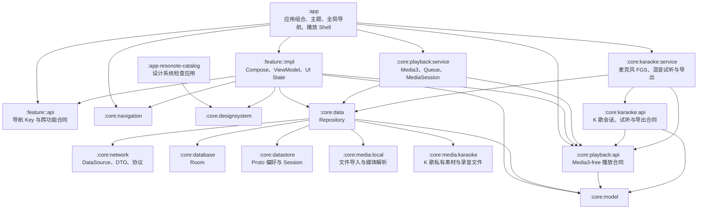
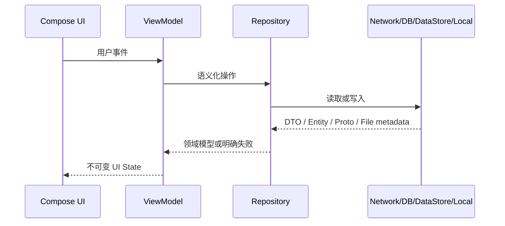
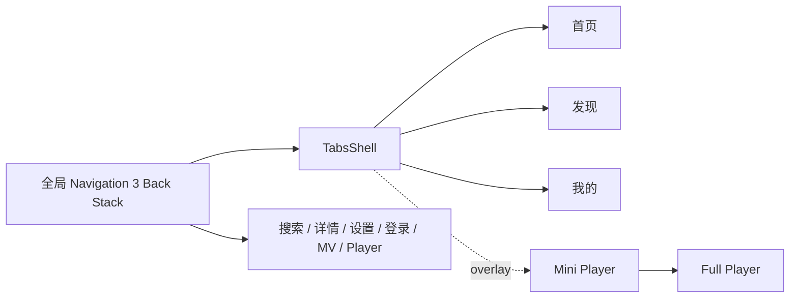
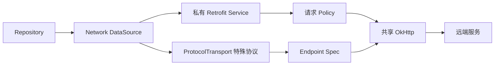

# Resonote 架构

本文是 Resonote 当前架构的规范来源。架构调整以当前模块、测试、产品合同和本文为依据，不依赖相邻项目的实现。

## 1. 架构目标

- UI、业务状态、数据访问和平台能力拥有明确所有者。
- Feature 依赖稳定合同，不依赖另一个 Feature 的实现细节。
- Network、Database、DataStore 与本地文件不会直接泄漏到 UI。
- 播放生命周期独立于页面生命周期，Activity 重建或页面切换不终止播放。
- 构建规则和测试约定集中复用，但模块特有行为仍留在模块内。

## 2. 工程拓扑



强制规则：

- `app` 可以组合 Feature 与 Core；其他模块不得反向依赖 `app`。
- Feature `impl` 可以依赖其他 Feature 的 `api`，不得依赖其他 Feature 的 `impl`。
- Core 不依赖 Feature。
- Feature 不直接依赖 Retrofit Service、DAO、Proto Store 或文件实现。
- `core:model` 不包含 DTO、Room Entity、Compose 或 Media3 类型。

## 3. 模块职责

### App

`:app` 持有 `MainActivity`、应用主题、全局 Back Stack、Tabs Shell、Mini Player 与播放 UI 的组合。它只负责装配，不承载可复用业务规则。

`:app-resonote-catalog` 独立展示主题与设计组件，不承载真实产品导航或业务状态。

### Feature

- `feature:<name>:api`：仅在目标需要被其他模块导航或调用时存在，包含稳定 Navigation Key 和最小跨模块类型。
- `feature:<name>:impl`：页面、ViewModel、不可变 UI State、事件和 Feature 内部组件。
- 只有一个消费者且没有公共合同的 Feature 可以只有 `impl`，例如当前 Home/Discover。

是否拆分 `api/impl` 由真实消费者决定，不为了目录对称创建空模块。

### Data 与存储

`core:data` 提供 Repository，是 Feature 获取应用数据的唯一入口。Repository 决定如何组合远端、本地数据库、偏好和媒体文件，并负责转换为 `core:model`。

事实源按数据寿命确定：

- 用户持久状态、设备历史和本地媒体以 Room / DataStore / App 私有文件为本地单一事实源。
- 首页快照是启动和离线降级缓存，成功刷新后更新，不替代远端内容事实。
- 搜索、榜单、在线歌单、艺人/专辑、云盘、歌词、MV 地址与短时播放地址以远端为事实源；没有产品合同不得为了形式上的“离线优先”持久化。
- 只有批准离线能力或后台同步后，才为对应数据增加 Room 缓存、刷新策略与 WorkManager；Repository 的存在本身不表示数据可离线使用。

- `core:network`：语义化 Network DataSource、私有 Retrofit Service/DTO、签名、Session、风控和特殊协议。
- `core:database`：Room Database、DAO、Entity 与 Migration。
- `core:datastore` / `datastore-proto`：主题、播放偏好、Session 等非关系型持久状态。
- `core:media:local`：Android 文件入口、私有副本、媒体校验和 metadata 提取。
- `core:media:karaoke`：K 歌伴奏/原唱的稳定私有副本、48 kHz 单声道人声分段和 512 MiB 安全余量检查。

### Playback

`core:playback:api` 定义 UI 可消费的后台音频播放状态和命令，不暴露 Media3。`core:playback:service` 持有音频 ExoPlayer、Queue、Source Resolver、失败恢复、播放历史资格和 MediaSessionService。

音频页面销毁不能成为停止播放的信号；Feature 只向 `PlaybackController` 发送意图并观察状态。

K 歌拥有独立的后台生命周期，但不是独立导航页面。播放详情页右上角开关只改变当前 Player 的控制状态，背景、顶栏、歌词 Pager、队列与播放位置保持连续；麦克风权限仍只在用户点击开始时请求。`core:karaoke:api` 提供不暴露 Media3 的会话、作品试听和导出合同；`core:karaoke:service` 以 microphone 前台服务持续录音，跟随播放队列切歌并把有效分段交给 `KaraokeRepository`。作品、混音参数、人声分段和伴奏/原唱切换时间轴以 Room 为事实源，底轨和人声源文件保存在 App 私有目录；v4 起作品可在录制中切换双底轨，试听与导出按切换边界裁剪并串接。已导出的 M4A 通过 MediaStore 写入 `Music/Resonote/Karaoke`，删除工程默认不删除该公开文件。试听和导出复用同一个 Media3 Composition，应用人声/伴奏增益、三段人声 EQ、±200 ms 对齐与最终 PCM 限幅。只有用户手动开始后才武装连续录音，短于 1 秒或静音的分段不能形成作品。

桌面歌词同样独立于页面生命周期。`DesktopLyricsController` 是设置使用的控制合同；`DesktopLyricsService` 订阅 `PlaybackController`、`LyricsRepository` 和歌词偏好，以 `TYPE_APPLICATION_OVERLAY` 持有可拖动的悬浮播放控制器。开启后悬浮窗口在 Resonote 内外始终显示，不随 App 前后台状态隐藏。桌面歌词不读取封面 Palette：默认使用白色背景和 Resonote 品牌色前景，背景色、前景色、背景透明度、歌词宽度（40%–100%，默认满宽）、固定字号（16–40sp）、描边颜色与粗细均可独立设置；字体阴影提供颜色、X/Y 偏移和 Z 轴模糊半径。所有操作按钮固定使用品牌色背景和白色图标。播放位置的公共状态保持 500ms 更新频率，桌面歌词只在播放中按单调时钟插值到 60ms 渲染帧，并使用视觉提前量避免过渡落后于人声；逐字歌词按真实字轴推进，只有整句时间的歌词按当前句到下一句的时长比例推进。已有歌词时，下一首歌词加载阶段冻结现有内容，不能插入“正在加载”中间帧。桌面歌词视觉上始终只绘制一行：角色前缀和内嵌换行不得产生额外可见行，超出当前宽度的原句在固定字号下内部切段，并随该句时间进度切换当前段，不得缩小字号或同时绘制多段。悬浮层以歌词区域作为持久化位置锚点，控制显隐期间保持窗口尺寸和坐标不变，只改变透明度。拖动必须以 `WindowManager.LayoutParams` 的真实窗口坐标为起点。顶部提供位置锁定和关闭，底部依次提供设置、上一首、播放/暂停、下一首与播放模式，其中播放按钮固定居中，四角按钮共享水平边距。控制显示使用短时纯透明度渐变，反向操作从当前透明度继续，不能造成歌词或按钮跳变。设置动作通过 App Intent 直达桌面歌词设置页。未锁定时恢复空白区域点击显隐全部控制、按钮操作和窗口拖动；锁定后整个悬浮窗口必须穿透触摸，禁止拖动和控制操作，通过前台服务常驻通知或桌面歌词设置页解锁。控制栏超时仅折叠操作区，歌词在暂停时仍保留。系统特殊权限、前台服务通知和窗口失败只影响桌面歌词，不得改变播放事实或播放器内歌词状态。

MV 是不支持后台播放、MediaSession 或画中画的前台页面资源。`:feature:video:impl` 可以在页面组合期间持有独立 Video Player，并必须在页面退出时释放；它不得加入音频 Queue、复用短时音频 URL 或改变后台音频的事实源。完整边界见 [ADR-0005](adr/0005-video-playback-ownership.md)。

## 4. UI 与数据流



- UI 不直接调用 Repository；事件先进入 ViewModel。
- ViewModel 暴露不可变 State/Flow，Composable 不保存业务事实副本。
- Repository 在边界完成 DTO/Entity 到领域模型映射。
- Loading、Empty、Offline、认证、协议和业务限制是不同状态，不能统一吞成空列表。
- 简单转发不增加 Use Case；当逻辑跨多个 Repository、被多个 ViewModel 复用或拥有独立测试价值时再引入领域操作。

## 5. 导航拓扑



- App 持有单一全局 Back Stack；Tab 根页面状态由 Tabs Shell 保存。
- Tab 切换不压入详情 Back Stack，重复点击当前 Tab 不重载或清空状态。
- 二级页面是 Shell 的全局兄弟目的地；Feature 只导出 Key 和 Entry。
- Mini Player 是应用播放 UI，不是 Navigation Key；Full Player 是全局目的地。

## 6. Network 拓扑



- DataSource 使用 `dailyRecommendations`、`resolveSongSource`、`accountHistory` 等业务名称。
- Policy/Spec 只记录真实协议行为：Method、Origin/Path、签名、Session、默认参数、认证业务码和响应格式。
- 不建立 Endpoint 人工编号、生产注册表或文档扫描映射。
- 普通 JSON 使用 Retrofit；二进制、加密或多阶段流程使用共享 OkHttp 的特殊协议实现。
- 请求和响应日志必须脱敏，不记录 Token、Cookie、设备身份或签名材料。

## 7. Build Logic 与质量拓扑

`build-logic` 通过 `pluginManagement.includeBuild` 接入。Convention Plugin 按职责组合 Android、Compose、Hilt、Lint 和文档治理；依赖版本统一由 `gradle/libs.versions.toml` 管理。

```text
源码行为       -> 模块单元测试 / 集成测试
Repository 映射 -> core:data 测试
Network 协议    -> core:network 测试
UI 语义与外观   -> Compose 测试 / Roborazzi
文档入口与链接   -> checkDocumentation
```

文档检查不替代行为测试，截图也不替代交互与无障碍断言。

## 8. 架构演进规则

新增模块或改变依赖方向前，先回答：

1. 该能力的唯一所有者是谁？
2. 是否真的存在跨模块消费者，需要稳定 `api`？
3. 数据事实位于 Network、Database、DataStore、Local Media 还是 Playback？
4. 能否沿用现有 Repository/Controller，而不创建平行入口？
5. 最小行为测试应放在哪个模块？

日常实现以本文和 [开发指南](DEVELOPMENT.md) 为准。本文未覆盖的新架构问题应从 Resonote 当前约束与真实消费者出发形成决策，并在需要时新增 ADR。
